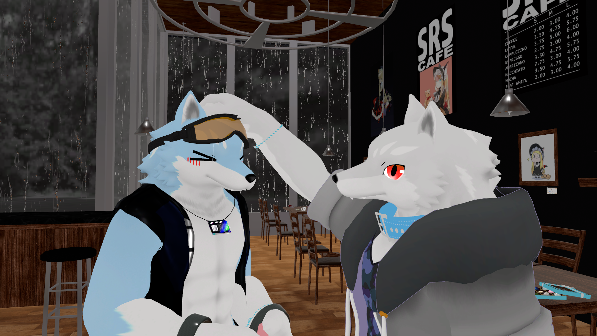
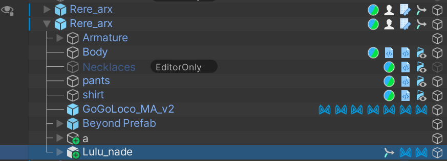

# 何ができるの？
・ルル君が撫でられたときに表情が変わるようになります  
・MMDをONにすると撫でられても表情が変わらなくなります  
  
  
# 注意事項など
・対応アバターはらすちんワークス様の[ルル (Lulu)](https://aoikarasu.booth.pm/items/4271776)です  
・MMDをONにした状態でMMDボタンを削除しているような場合は撫でられたときに表情が変わりません  
  
# 導入手順
1.&nbsp;[Modular Avatar](https://modular-avatar.nadena.dev/ja)をプロジェクトに追加します  
  
2.&nbsp;[Releases](https://github.com/Luke-514/Lulu_Nade/releases/latest)からLulu_Nade.unitypackageをダウンロードして、プロジェクトにインポートします  
  
3.&nbsp;Assets>Lulu_Nadeの中にある**Lulu_nade.prefab**をアバター直下に追加します  

  
  
# 参考
ケーキのPC情報集会所  
【VRChat】撫でられたら喜んじゃう！Contact機能を使ってみた！  
https://keiki002.com/vr/vrchat-contact/  
  
# 免責事項
本アセットの使用によって発生した、いかなる損害に対しても作者は一切の責任を負いません  
  
# 利用規約
本アセットの改変・二次配布を許可します  
(二次配布を行う際はクレジットに作者の名前を記載していただけると嬉しいです)  
  
# 作者
Luke514  
  
# Special Thanks
優希@白狼わんこ  
  
# 寄付
https://buymeacoffee.com/luke514
